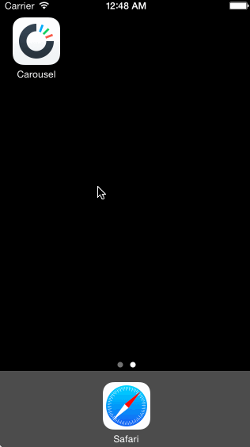

# Week2-Carousel
<b> Overview - </b>
In this project, I used a variety of UI tools from scroll views to animations to switches to prototype the Dropbox Carousel.

<b> Tasks Completed - </b>
All tasks and milestones of the assignment were completed including the following optional tasks...
- Animate individual image tiles into position on the home screen
- Sign up page with form and button moving up when the keyboard shows
- Used the inbuilt switch element for the terms agreement instead of a checkbox

<b> Time spent - </b>
I probably spent a good 12-14 hours doing this assignment over the course of three days (Thu - Sat). 

<b> Demo </b>

